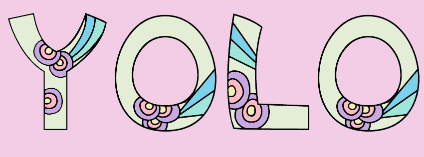

<h1 align="center">Hello 👋 </h1>

 
 My name is Aseel Dweedar ✨, I'm a software developer. From Jordarn. and currently working at ASAC (Abdul Aziz Al Ghurair School of Advanced Computing). You can find me on

<a href="https://www.leetcode.com/aseel_dweedar" target="blank">,</a> or reach me on <b>archaseel.1992@gmail.com</b>

- 🔭 I’m currently working on:

- 🌱 I’m currently learning **Angular**

- 👨‍💻 All of my projects are available at [Assel Dweedar-portfolio](https://portfolio-aseel.netlify.app)

- 📄 Know about my experiences [Assel Dweedar-Resume](https://docs.google.com/document/d/1BWFNcgygQ5YMuwx2K6bBbZywYSQFnklJcKjaYlkR9kU/edit)

- ⚡ Fun fact **I Love CSS :D**

    

 

<h2 align="left">📚 Reading Note & Blogs</h2>

You can check my reading note, and alse the blogs I created here :

- [reading-notes](https://aseel-dweedar.github.io/reading-notes)
- [blogs](https://aseel-dweedar.github.io/reading-notes/blogs)

 

<h2 align="left">👩‍💻 Languages and Tools</h2>

 

                  </a>   

 

 
